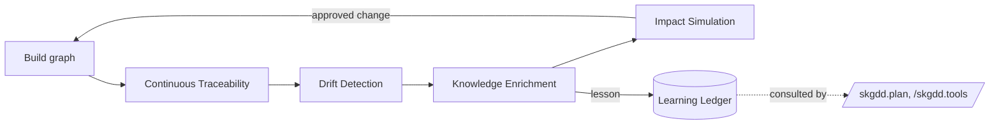

# The Meta-Methodology Layer

The workflow commands (`specify → plan → tasks → implement`) build the project.
The **meta-methodology** keeps it honest and makes it *self-evolving*. These four
loops run continuously, across the whole graph, regardless of which phase you are
in.

## A. Continuous Traceability Enforcement

Every node must be able to answer three questions at any time:

1. **Why does this exist?** — an upstream edge (`derived_from`, `refines`,
   `governed_by`).
2. **What depends on it?** — downstream edges (`required_by`, `satisfied_by`).
3. **What validates it?** — a `verified_by` `Test`.

A node that cannot answer all three is incomplete. `graph.py trace` and
`graph.py lint` report the gaps. This is the standing rule behind the three
spines — traceability is not a phase, it is always on.

## B. Drift Detection Loop

```
spec ≠ implementation → detect → flag → update spec OR fix code
```

Drift is treated as a defect (constitution C-DRIFT-01). Sources of drift the kit
watches:

- A body `[[link]]` with no backing graph edge (typed-link lint).
- A node marked `done/verified` whose test is `failing` or missing.
- Code/features with no owning `T-*`/`R-*` node (reverse-trace in
  `/skgdd.reconcile`).
- A `Decision` superseded in code but still `accepted` in the graph.
- An `external_ref` whose tracker status disagrees with the node (`/skgdd.sync`).

Run: `/skgdd.reconcile`. Output is a drift report; each item is fixed by updating
the node or the code — never by leaving them divergent.

## C. Knowledge Enrichment Loop

```
failure → learning → node update → graph update → future prevention
```

Every failure is fuel. When a test fails, an estimate is wrong, or a tool
underdelivers, a `Loop` records it and — if durable — a `Lesson` (`LS-*`) is
written to the Learning Ledger. Lessons `inform` the nodes they touch and can
`amend` constitution articles or annotate `Tool` nodes, so the same mistake is
harder to repeat. Run: `/skgdd.loop` then `/skgdd.learn`.

This is the mechanism that makes the kit "self-develop like a human": it
accumulates, and consults, its own experience.

## D. Impact Simulation Before Change

```
change → simulate graph → show impact → approve → apply
```

Before editing any node, simulate the blast radius:

```powershell
python .skgdd/scripts/graph.py impact <NODE-ID> knowledge
```

The engine walks reverse-dependency edges and lists every requirement, task,
test, tool, and risk downstream — and therefore which tests must be re-run. Only
after the impact is reviewed and approved is the change applied (and, if it
reverses a prior decision, recorded as an `Amendment`). Run: `/skgdd.impact`.

## How the loops compose



The workflow moves the project forward; the meta-loops fold experience back in.
Accuracy compounds because every pass leaves the graph and the ledger smarter
than it found them.
